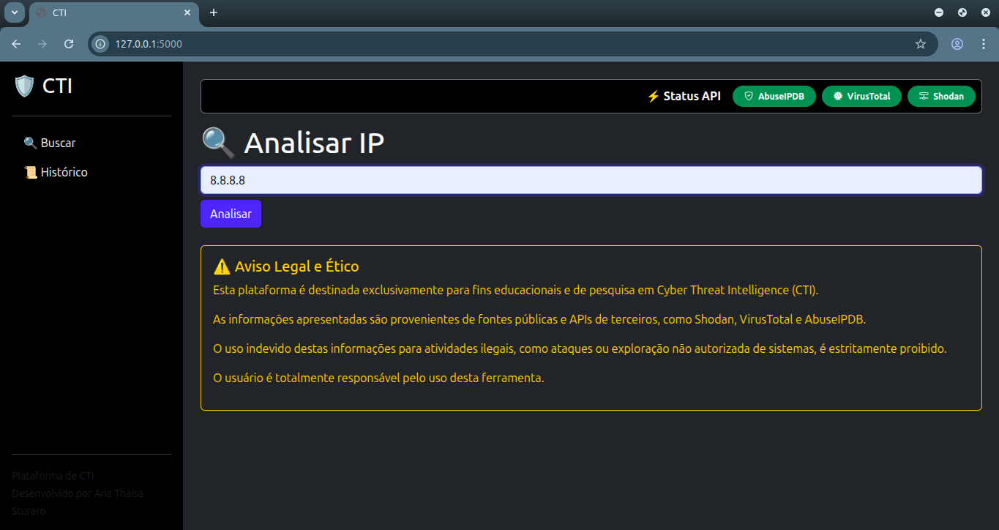
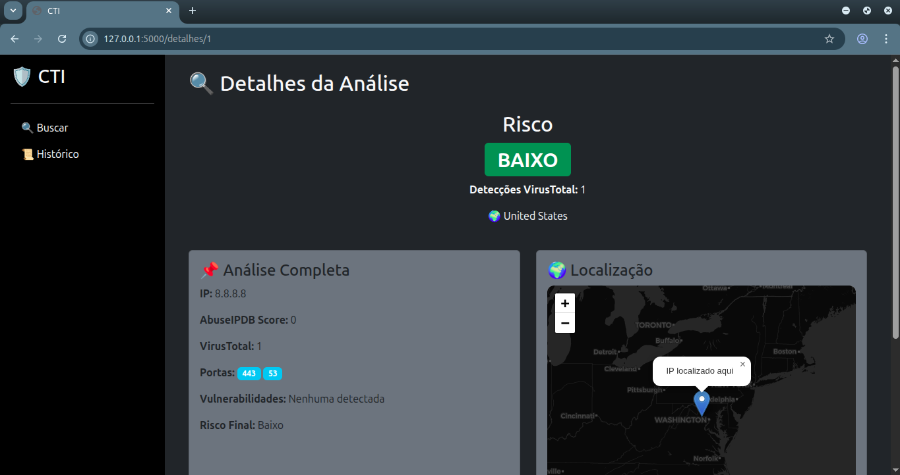
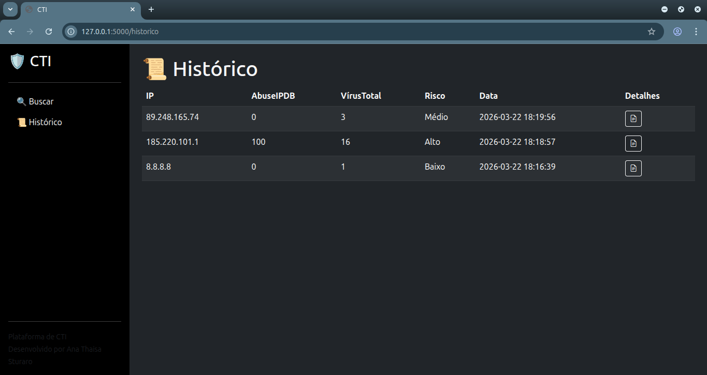
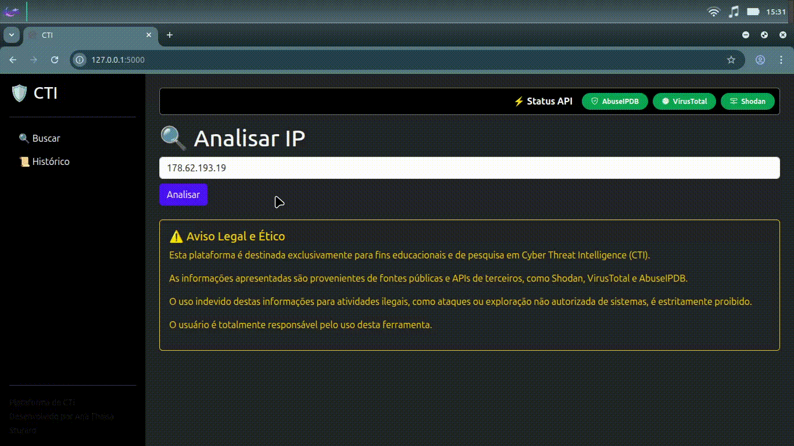

# 🛡️ Projeto de CTI - Cyber Threat Intelligence

<p align="justify">
Uma plataforma para análise de de inteligência de ameaças (Cyber Threat Intelligence), permitindo investigar IPs através do uso de APIs de ferramentas de análise de ameaças. 
</p>

## 🎯 Objetivo

<p align="justify">
Este projeto foi desenvolvido com o objetivo de estudar e compreender conceitos de Cyber Threat Intelligence (CTI), incluindo integração com APIs externas, análise de reputação de IPs e visualização de dados.
</p>

## 🚀 Funcionalidades

 - 🔍 Conultada de IP para analisar 
 -  Integração com
    - AbuseIPDB
    - VirusTotal
    - Shodan
 -   Classificação de risco (Baixo, Médio e Alto)
 - 🌍 Geolocalização de IPs com mapa interativo
 -  📜  Histórico das análises
 - ⚡️ Status das APIs
 - 📊 Interface Web (Dashboard)

## 🛠️ Tecnologias utilizadas

- Python (Flask)
- SQLite
- HTML + Bootstrap 5
- Leaflet.js (mapa)
- APIs externas:
  - AbuseIPDB
  - VirusTotal
  - Shodan

## 📸 Demonstração

<p align="justify">
A imagem abaixo mostra a pesquisa por um IP, nesse exemplo foi utilizado o DNS do Google para exemplificação.
</p>

<p align="center">
    
</p>

<p align="justify">
A seguinte imagem apresenta a análise do IP, mostrando o Risco em um componente, verde para risco baixo, amarelo para risco médio e vermelho para risco alto. Também apresenta dois cards, um com a análise completa e outra com a localização (mapa) contendo informações como país, cidade e ISP.
</p>

<p align="center">
    
</p>
<p align="justify">
A figura abaixo mostra o histórico de buscas, podendo ver os detalhes da análise novamente.
</p>
<p align="center">
    
</p>
<p align="justify">
Demonstração do funcionamento.
</p>
<p align="center">
    
</p>

## ⚙️ Instalação

```bash
git clone https://github.com/anasturaro/Projeto_CTI_cyber_threat_intelligence.git
cd projeto-cti
pip install -r requirements.txt
python app.py
```
## 🔑 Configuração

<p align="justify">
Para utilizar a aplicação, é necessário configurar as chaves das APIs utilizadas.
</p>
<p align="justify">
Crie um arquivo .env na raiz do projeto e adicione suas credenciais:
</p>

```text
ABUSEIPDB_API_KEY=sua_chave_api
VIRUSTOTAL_API_KEY=sua_chave_api
SHODAN_API_KEY=sua_chave_api
```
## ⚠️ Aviso Legal e Ético
<p align="justify">
Esta plataforma é destinada exclusivamente para fins educacionais e de pesquisa em Cyber Threat Intelligence (CTI).
</p>
<p align="justify">
As informações apresentadas são provenientes de fontes públicas e APIs de terceiros, como Shodan, VirusTotal e AbuseIPDB.
</p>
<p align="justify">
O uso indevido destas informações para atividades ilegais, como ataques ou exploração não autorizada de sistemas, é estritamente proibido.
</p>
<p align="justify">
O usuário é totalmente responsável pelo uso desta ferramenta.
</p>

## ⚠️ Limitações
<p align="justify">
Este projeto utiliza APIs externas em seus planos gratuitos, que possuem restrições.
</p>
- 🔎 O Shodan pode não fornecer dados completos de vulnerabilidades (CVEs) sem um plano pago  
- ⏱️ Limite de requisições por minuto/dia  
- 📊 Quantidade limitada de consultas  
<p align="justify"> 
Essas limitações podem impactar a profundidade das análises realizadas pela aplicação.
</p>

## 📄 Licença
<p align="justify">
Este projeto está sob a licença MIT.
</p>
# Projeto_CTI_cyber_threat_intelligence
